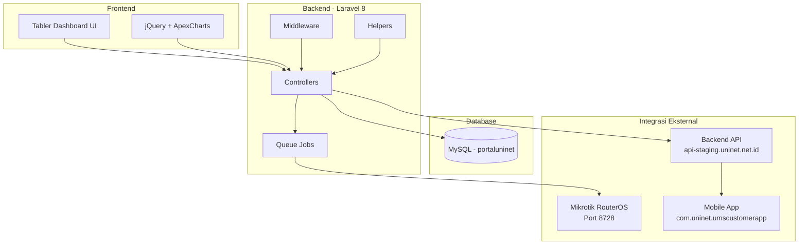
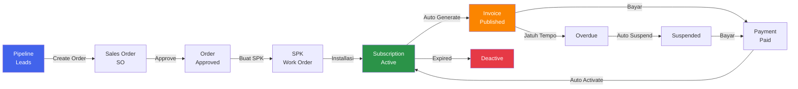
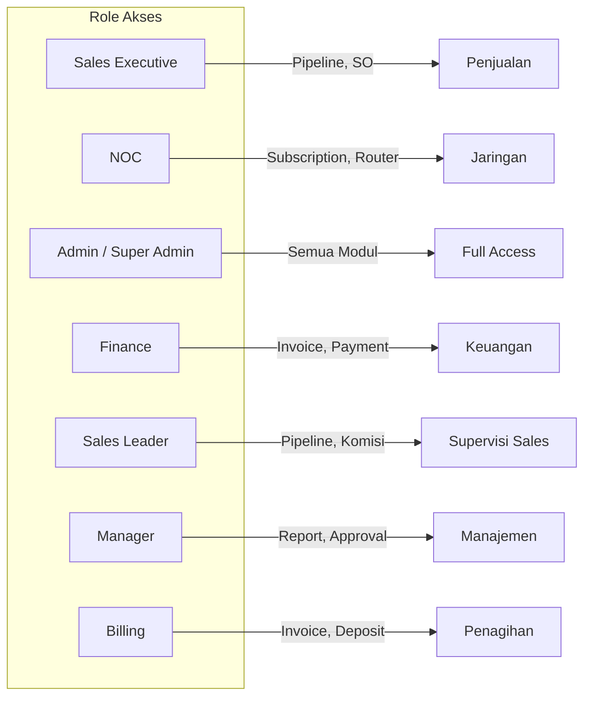
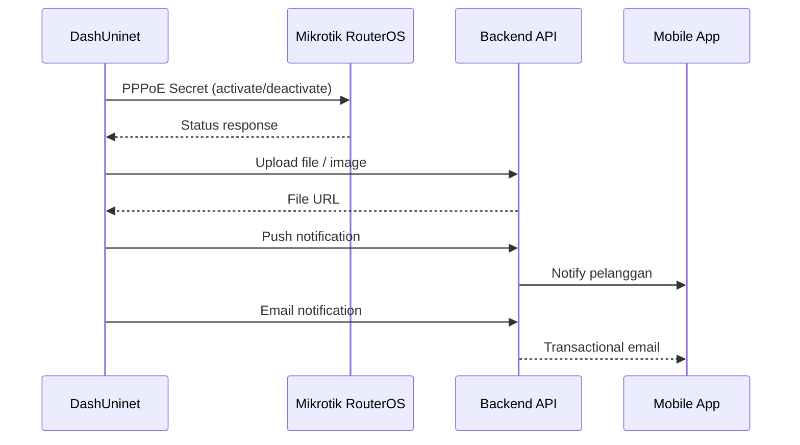

<div align="center">


# DashUninet

### Portal Utama Uninet Untuk Layanan Pelanggan

**PT. Uninet Media Sakti**

[](https://laravel.com)
[](https://www.php.net)
[](https://www.mysql.com)
[](https://tabler.io)

</div>

---

## Deskripsi

**DashUninet** adalah portal back-office CRM/ERP terintegrasi untuk pengelolaan layanan internet **PT. Uninet Media Sakti**. Aplikasi ini mengelola siklus hidup pelanggan lengkap mulai dari leads penjualan, order, aktivasi langganan (otomatis via Mikrotik RouterOS), penagihan invoice, hingga support ticket.

---

## Arsitektur Sistem



---

## Alur Kerja Pelanggan



---

## Fitur Utama

### Dashboard

| Dashboard | Fungsi |
|-----------|--------|
| **Dashboard Utama** | Ringkasan performa bisnis secara real-time |
| **Revenue** | Analisis pendapatan per periode |
| **Subscription** | Statistik langganan aktif/nonaktif |
| **Sales Order** | Performa penjualan & progress order |

### Modul Penjualan

| Modul | Fungsi |
|-------|--------|
| **Pipeline** | Manajemen leads & prospek penjualan |
| **Sales Order** | Pembuatan, approve, progress tracking order |
| **SPK / BA** | Surat Perintah Kerja & Berita Acara digital |
| **Komisi** | Tracking komisi sales per order |

### Modul Layanan

| Modul | Fungsi |
|-------|--------|
| **Subscription** | Aktivasi, update, suspensi, deaktivasi langganan |
| **Mikrotik Router** | Manajemen perangkat jaringan & PPPoE secrets |
| **Auto Job** | Auto activate/suspend/deactivate via queue jobs |

### Modul Keuangan

| Modul | Fungsi |
|-------|--------|
| **Invoice** | Draft, publish, batch publish, reminder |
| **Pembayaran** | Upload bukti bayar, approval, payment tracking |
| **Deposit** | Topup deposit, approval, auto-deduct balance |
| **Promo** | Kode promosi & diskon |

### Modul Pelanggan

| Modul | Fungsi |
|-------|--------|
| **Customer** | Data pelanggan aktif, korporat, membership |
| **Downline** | Sistem referral & jaringan pelanggan |
| **Credit Point** | Poin loyalitas & reward redemption |
| **Loyalty** | Katalog reward & pengelolaan hadiah |

### Modul Support

| Modul | Fungsi |
|-------|--------|
| **Ticket** | Layanan pelanggan (open/close/overdue) |
| **Documentation** | CMS dokumentasi & panduan pengguna |

### Modul Lainnya

| Modul | Fungsi |
|-------|--------|
| **Product** | Katalog produk, harga, billing cycle |
| **Reseller** | Manajemen mitra/reseller |
| **Project** | Site project & area cakupan |
| **Banner** | Manajemen banner aplikasi |
| **Report** | Export laporan ke Excel (Customer, Subscription, Invoice) |

---

## Role & Akses



| Role | Akses Utama |
|------|-------------|
| **Sales Executive** | Pipeline, Sales Order, Komisi |
| **NOC** | Subscription, Router, Auto Jobs |
| **Admin** | Seluruh modul (full access) |
| **Finance** | Invoice, Payment, Deposit, Report |
| **Sales Leader** | Pipeline, Komisi, Supervisi |
| **Manager** | Report, Approval, Manajemen |
| **Billing** | Invoice, Deposit, Penagihan |

---

## Integrasi Eksternal



| Layanan | Protocol | Fungsi |
|---------|----------|--------|
| **Mikrotik RouterOS** | TCP :8728 | PPPoE secret management, disconnect sessions |
| **Backend API** | HTTPS | File upload, push notification, email |
| **Mobile App** | Deep Link | `com.uninet.umscustomerapp` (Android) |

---

## Tech Stack

| Layer | Teknologi |
|-------|-----------|
| **Backend** | Laravel 8.75, PHP ^7.3\|^8.0 |
| **Database** | MySQL (portaluninet) |
| **Frontend** | Tabler Dashboard, jQuery 3.6, ApexCharts |
| **Auth** | Laravel Session + Role-Based Access Control |
| **API Auth** | Laravel Sanctum |
| **Export** | Maatwebsite Excel |
| **ID Generator** | haruncpi/laravel-id-generator |
| **Network** | Mikrotik RouterOS API (PHP Socket Client) |
| **CI/CD** | GitLab CI → SSH Deploy |

---

## Setup & Installation

### Prerequisites

- PHP ^7.3 atau ^8.0
- MySQL 5.7+
- Composer
- Node.js & NPM
- Mikrotik Router (untuk integrasi jaringan)

### Instalasi

```bash
# Clone repository
git clone <repository-url>
cd dashuninet

# Install dependency PHP
composer install

# Install dependency JS
npm install

# Copy environment
cp .env.example .env

# Generate app key
php artisan key:generate

# Konfigurasi database di .env
# DB_DATABASE=portaluninet
# DB_USERNAME=root
# DB_PASSWORD=

# Build assets
npm run dev

# Jalankan server
php artisan serve
```

### Konfigurasi Environment

Variabel penting di `.env`:

```env
APP_NAME=DashUninet
APP_URL=http://localhost:8000

DB_CONNECTION=mysql
DB_HOST=127.0.0.1
DB_PORT=3306
DB_DATABASE=portaluninet
DB_USERNAME=root
DB_PASSWORD=

# Backend API (file upload, notification)
BACKEND_URL=https://api-staging.uninet.net.id
```

---

## Struktur Aplikasi

```
dashuninet/
├── app/
│   ├── Console/            # Task scheduler
│   ├── Exports/            # Excel export classes
│   ├── Helpers/            # DepositHelper, SubscriptionHelper
│   ├── Http/
│   │   ├── Controllers/    # 17 controllers
│   │   └── Middleware/     # Auth, FraudOrder, Cors
│   ├── Jobs/              # AutoactiveJob, AutodeactiveJob, dll
│   ├── Library/           # RouterosAPI client
│   └── Models/            # 48 Eloquent models
├── resources/views/
│   ├── layouts/           # Main layout (console.blade.php)
│   ├── component/
│   │   ├── navbar.blade.php
│   │   ├── canvas/        # 19 filter panels
│   │   └── modal/         # 43 modal dialogs
│   └── page/              # 63+ page views
├── routes/
│   ├── web.php            # 338 routes
│   └── api.php            # API endpoints
└── public/assets/         # Tabler UI, static files
```

---

<div align="center">

**PT. Uninet Media Sakti** — DashUninet Portal

</div>
